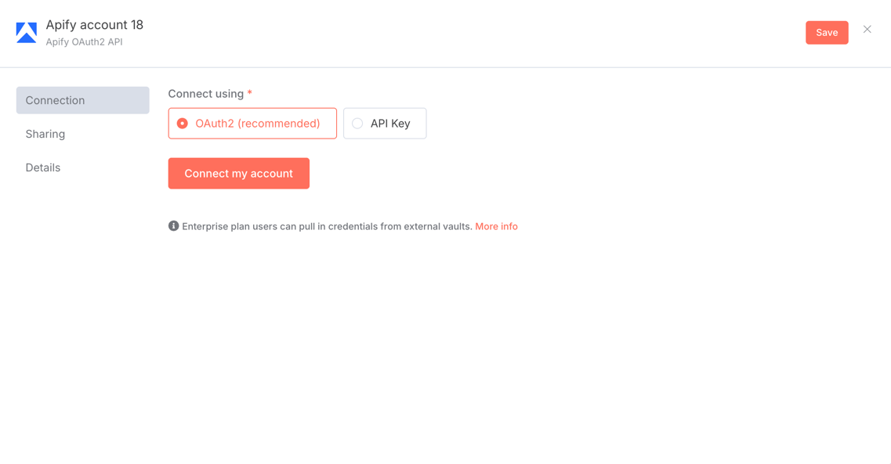

# n8n Nodes - Apify integration

This is an n8n community node that integrates [Apify](https://apify.com) [Website Content Crawler](https://apify.com/apify/website-content-crawler) with your n8n workflows. 

Use this node to run the Website Content Crawler, configure its input, and fetch results directly in your workflows.

[Website Content Crawler](https://apify.com/apify/website-content-crawler) is an Apify Actor that can perform a deep crawl of one or more websites and extract text content from the web pages. It is useful to download data from websites such as documentation, knowledge bases, help sites, or blogs.

## Table of contents

- [Installation](#installation)
- [Operations](#operations)
- [Credentials](#credentials)
- [Compatibility](#compatibility)
- [Usage](#usage)
- [Release](#releasing-a-new-version)
- [Version History](#version-history)
- [Troubleshooting](#troubleshooting)

## Installation

### ⚙️ Prerequisites

- Node.js (recommended: v18.10+)

---

### 1. Running n8n locally
Just run the commands below, it will come with hot reloading.

```bash
npm i
npm run dev
```

## Self-hosted n8n: Public webhook URL for triggers

This configuration is required for our service's trigger functionality to work correctly.

By default, when running n8n locally, it generates webhook URLs using `localhost`, which external services cannot reach. To fix this:

1. **Set your webhook URL**  
In the same shell or Docker environment where n8n runs, export the `WEBHOOK_URL` to a publicly-accessible address. For example:
  ```bash
  export WEBHOOK_URL="https://your-tunnel.local"
  ```
2. **Restart n8n** 
  ```bash
  npm run dev
  ```

## Operations


This node provides a single operation to run the Apify Website Content Crawler Actor with custom input parameters.

### Run Crawler
Execute the Website Content Crawler with optional input parameters to crawl websites and extract text content

## Credentials

The node supports two authentication methods:

1. **API key authentication**
   - Configure your Apify API key in the n8n credentials section under `apifyApi`

2. **OAuth2 authentication** (available only in n8n cloud)
   - Configure OAuth2 credentials in the n8n credentials section under `apifyOAuth2Api`




## Compatibility

This node has been tested with n8n version 1.57.0.

## Usage

You can use this node in various workflows. It is especially useful for extracting content from websites for LLMs and other AI applications.

1. **Set up a workflow**: Create a new workflow in n8n.
2. **Add AI Agent node**: Add an AI Agent node to your workflow to process or analyze the extracted content.
3. **Add Website Content Crawler node**: Insert the node into your workflow and connect it as an AI Agent tool.
4. **Configure credentials**: Enter your Apify API key or use Apify OAuth flow.
5. **Execute the workflow**: Run the workflow using the chat interface.


For more information, see:
- [Apify Website Content Crawler](https://apify.com/apify/website-content-crawler)
- [n8n Community Nodes Documentation](https://docs.n8n.io/integrations/community-nodes/)
- [Apify API Documentation](https://docs.apify.com)

# Releasing a New Version

This project uses a GitHub Actions workflow to automate the release process, including publishing to npm. Here's how to trigger a new release.

**Prerequisites (for all methods):**

* Ensure your target branch on GitHub is up-to-date with all changes you want to include in the release.
* Decide on the new version number, following semantic versioning (e.g., `vX.Y.Z`).
* Prepare your release notes detailing the changes.
* If you're using CLI to release, make sure you have the [GitHub CLI (`gh`)](https://cli.github.com/) installed and authenticated (`gh auth login`).

---

## Method 1: Using the GitHub Web UI (Recommended for ease of use)

1.  **Navigate to GitHub Releases:**
    * Go to your repository’s "Releases" tab

2.  **Draft a New Release:**
    * Click the **“Draft a new release”** button.

3.  **Create or Choose a Tag:**
    * In the “Choose a tag” dropdown:
        * **Type your new tag name** (e.g., `v1.2.3`).
        * If the tag doesn't exist, GitHub will prompt you with an option like **“Create new tag: v1.2.3 on publish.”** Click this.
        * Ensure the **target branch** selected for creating the new tag is correct. This tag will point to the latest commit on this target branch.

4.  **Set Release Title and Notes:**
    * Set the "Release title" (e.g., `vX.Y.Z` or a more descriptive title).
    * For the release notes in the description field, you have a few options:
        * **Write your prepared release notes.**
        * **Click the "Generate release notes" button:** GitHub will attempt to automatically create release notes based on merged pull requests since the last release. You can then review and edit these auto-generated notes.

5.  **Publish the Release:**
    * Click the **“Publish release”** button.

    *Upon publishing, GitHub creates the tag from your specified branch and then creates the release. This "published" release event triggers the automated workflow.*

---

## Method 2: Fully CLI-Driven Release

This method uses the GitHub CLI (`gh`) for all steps, including tag creation.

1.  **Ensure your local target branch is synced and changes are pushed:**
    ```bash
    git checkout master
    git pull origin master
    ```

2.  **Create the Release (which also creates and pushes the tag):**
    Replace `vX.Y.Z` with your desired tag/version. The command will create this tag from the latest commit of your specified `--target` branch (defaults to repository's default branch, if `--target` is omitted and the branch is up to date).

    ```bash
    gh release create vX.Y.Z \
        --target master \
        --title "vX.Y.Z" \
        --notes "Your detailed release notes here.
        - Feature X
        - Bugfix Y"

    # Or, to use notes from a file:
    gh release create vX.Y.Z \
        --target master \
        --title "vX.Y.Z" \
        --notes-file ./RELEASE_NOTES.md

    # Or, to generate notes from pull requests (commits must follow conventional commit format for best results):
    gh release create vX.Y.Z \ 
        --target master \
        --title "vX.Y.Z" 
        --generate-notes
    ```
    
    * `vX.Y.Z`: The tag and release name.
    * `--target <branch>`: Specifies which branch the tag should be created from (e.g., `master`). If the tag `vX.Y.Z` doesn't exist, `gh` will create it based on the HEAD of this target branch and push it.
    * `--title "<title>"`: The title for your release.
    * `--notes "<notes>"` or `--notes-file <filepath>` or `--generate-notes`: Your release notes.

    *This command will create the tag, push it to GitHub, and then publish the release. This "published" release event triggers the automated workflow.*

---

## Post-Release: Automated Workflow & Verification (Common to all methods)

Regardless of how you create and publish the GitHub Release:

1.  **Automated Workflow Execution:**
    * The "Release & Publish" GitHub Actions workflow will automatically trigger.
    * It will perform:
        1.  Code checkout.
        2.  Version extraction (`X.Y.Z`) from the release tag.
        3.  Build and test processes.
        4.  Update `package.json` and `package-lock.json` to version `X.Y.Z`.
        5.  Commit these version changes back to the branch the release was targeted from with a message like `chore(release): set version to X.Y.Z [skip ci]`.
        6.  Publish the package `@apify/n8n-nodes-apify-content-crawler@X.Y.Z` to npm.

2.  **Verify the Package on npm:**
    After the workflow successfully completes (check the "Actions" tab in your GitHub repository):
    * Verify the new version on npm:
        ```bash
        npm view @apify/n8n-nodes-apify-content-crawler version
        ```
        This should print `X.Y.Z`.

## Version history

Track changes and updates to the node here.

## Troubleshooting

### Common issues

1. **Authentication errors**
   - Verify your API key is correct
   - Ensure your Apify account has access to the Website Content Crawler

2. **Crawler execution failures**
   - Check the input parameters (URLs, crawler settings)
   - Verify resource limits (memory, timeout)
   - Review Apify Console for detailed error messages

### Getting help

If you encounter issues:
1. Check the [Apify API documentation](https://docs.apify.com)
2. Review the [n8n Community Nodes documentation](https://docs.n8n.io/integrations/community-nodes/)
3. Open an issue in the [GitHub repository](https://github.com/apify/n8n-nodes-apify-content-crawler)
